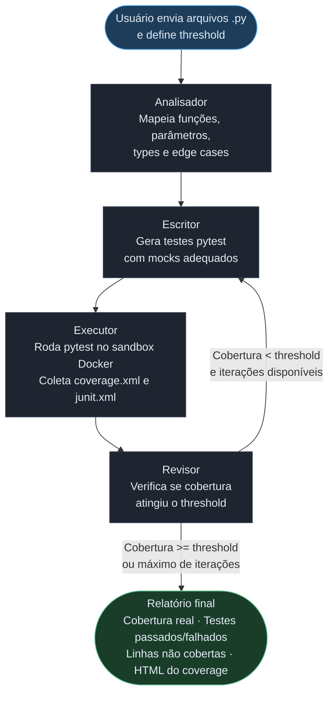
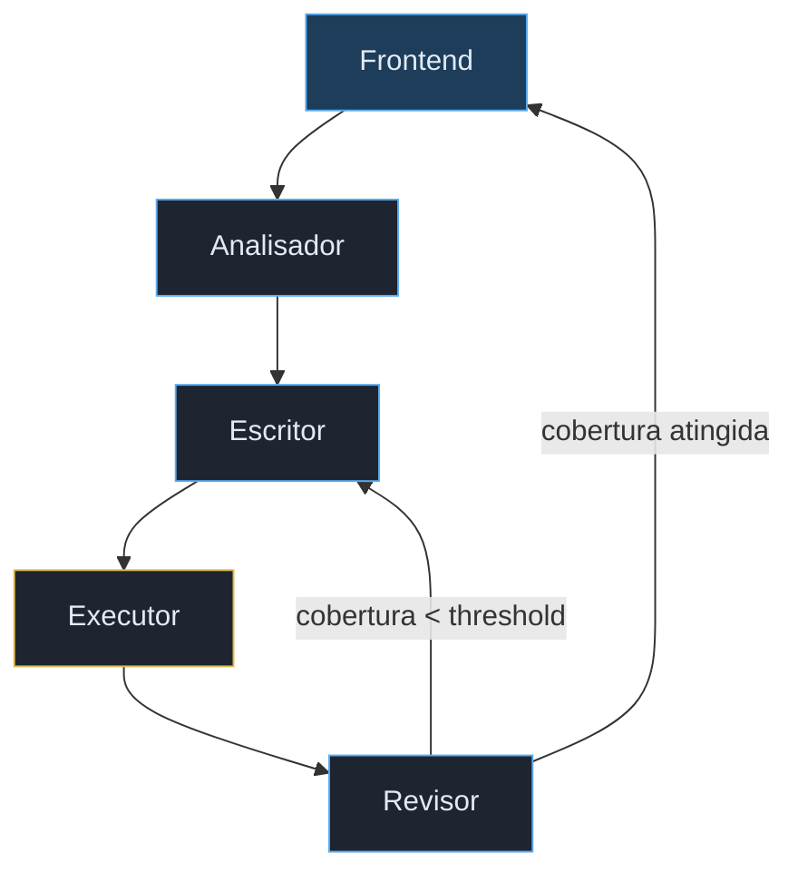

# AutoTest — Geração Automática de Testes com Multi-Agentes


Sistema que recebe arquivos Python, executa um pipeline de agentes de IA e entrega testes pytest com cobertura verificada.

---

## Como funciona



---

## Por que esse projeto?

Escrever testes é uma das partes mais importantes do desenvolvimento. Ferramentas que apenas *sugerem* testes resolvem metade do problema já que você ainda precisa executar, verificar cobertura e iterar manualmente.

A ideia foi construir um sistema que fecha esse ciclo sozinho: gera, executa, mede e itera até atingir um threshold de cobertura configurável. O resultado é um arquivo de testes funcional e um relatório HTML de cobertura linha por linha.

---

## Arquitetura

O sistema usa um grafo de agentes orquestrado pelo **LangGraph**, onde cada nó tem uma responsabilidade única:



| Agente | Responsabilidade | Temperatura |
|---|---|---|
| Analisador | Mapeia funções, parâmetros, tipos e edge cases | 0 |
| Escritor | Gera testes pytest com mocks adequados | 0.2 |
| Executor | Roda pytest no Docker, coleta coverage e junit | — |
| Revisor | Decide se itera ou encerra baseado no threshold | 0 |

### Stack

| Camada | Tecnologia |
|---|---|
| Orquestração de agentes | LangGraph |
| LLM | GPT-4o via LangChain |
| Backend | FastAPI + Uvicorn |
| Frontend | React + Vite |
| Sandbox de execução | Docker (Python 3.11, pytest, pytest-cov) |
| Prompts | Jinja2 templates |

---

## O que foi construído

- Pipeline multi-agente com loop condicional real, não é uma chain linear
- Sandbox Docker isolado para execução segura de código de terceiros
- Prompts separados em Jinja2 com lógica condicional por iteração
- Backend FastAPI com endpoint de upload multipart e serving de arquivos estáticos
- Frontend React com feedback visual de etapa atual, ring de cobertura SVG e link direto para o HTML do coverage
- Correção automática de imports e padrões problemáticos de mock nos testes gerados
- Relatório final com cobertura, testes passados/falhados e linhas não cobertas por arquivo

---

## Resultados

| Arquivo | Cobertura | Iterações |
|---|---|---|
| `sample_code.py` (algoritmos clássicos) | 100% | 2 |
| `library.py` (sistema de biblioteca) | 96% | 1 |
| `executor.py` (infraestrutura com Docker) | 49% | 5 |


---

## Aprendizados

**LangGraph na prática** — a diferença entre um grafo e uma chain simples é o loop condicional. Implementar o `should_continue` que decide entre iterar ou encerrar foi o ponto central da arquitetura.

**Prompts como código** — separar os prompts em arquivos Jinja2 foi uma decisão que pagou dividendos. Ajustar o comportamento do Escritor nas iterações subsequentes (focar só nas linhas não cobertas) sem tocar no Python foi simples e rápido.

**Sandboxing tem nuances** — a primeira versão montava o diretório de código como read-only (`:ro`), o que quebrava o pytest-cov que precisa escrever o `.coverage`. O `PYTHONPATH=/code` foi outro ajuste necessário para os testes conseguirem importar o código sendo testado.

**LLMs geram mocks problemáticos** — o padrão `side_effect=lambda p: ...` gerado pelo GPT-4o quebra quando `Path.exists` é chamado internamente pelo pytest com argumentos extras. A solução foi uma função de pós-processamento que corrige automaticamente esses padrões antes de salvar os testes.

**Testes passados ≠ cobertura** — 100% de cobertura com testes falhando é possível e aconteceu. Cobertura mede linhas executadas, não corretude das assertivas. O sistema mostra os dois separadamente por esse motivo.

---

## Limitações conhecidas

**Dependências externas** — o sandbox tem apenas `pytest` e `pytest-cov`. Código que importa bibliotecas de terceiros precisará de mocks, o que pode reduzir a qualidade dos testes gerados.

**Código de infraestrutura** — arquivos que dependem de Docker, subprocess ou filesystem real são difíceis de testar com mocks. Nesses casos a cobertura será parcial.

**Casos de uso ideais** — código Python puro com lógica de negócio, algoritmos, parsers e módulos sem dependências externas pesadas.

---

## Melhorias possíveis:

- **Isolamento completo do sandbox** — `--network none` e usuário sem privilégios dentro do container
- **Suporte a `requirements.txt`** — instalar dependências do usuário no sandbox antes de executar
- **Diagnóstico de falhas** — quando um teste falha, um agente adicional analisa o motivo e decide se é bug no teste ou bug no código
- **Suporte a outras linguagens** — JavaScript/TypeScript com Jest seria o próximo passo natural

## Estrutura do projeto

```
multi-agent-autotest/
├── backend/
│   ├── agents/
│   │   ├── analyzer.py      # Agente Analisador
│   │   ├── writer.py        # Agente Escritor
│   │   ├── reviewer.py      # Agente Revisor
│   │   └── graph.py         # Grafo LangGraph
│   ├── tools/
│   │   └── executor.py      # Execução no sandbox Docker
│   ├── prompts/
│   │   ├── analyzer.j2
│   │   ├── writer.j2
│   │   └── reviewer.j2
│   └── api/
│       ├── main.py
│       └── routes.py
├── frontend/
│   └── src/
│       └── App.jsx
├── sandbox/
│   └── Dockerfile
├── examples/
│   ├── sample_code.py       # Algoritmos clássicos
│   └── library.py           # Sistema de biblioteca
├── assets/
│   ├── result_sample_code.png   # Resultado: 100% cobertura
│   └── result_library.png       # Resultado: 96% cobertura
└── Makefile
```
