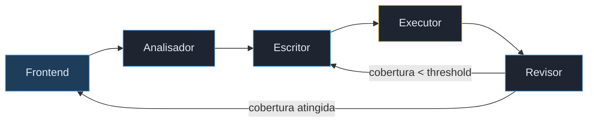

# AutoTest — Geração Automática de Testes com Multi-Agentes


Sistema que recebe arquivos Python, executa um pipeline de agentes de IA e entrega testes pytest com cobertura verificada.

> **An English version of this documentation is available at the [end of this page](#-english-version).**

> **TL;DR** Sistema multi-agente que analisa código Python, gera testes automaticamente, executa em sandbox isolado e itera até atingir um threshold de cobertura configurável. O projeto foca em arquitetura de sistemas com LLMs, loops de avaliação automática e orquestração baseada em grafo.

---

## Como funciona


---

## Por que esse projeto?

Escrever testes é uma das partes mais importantes do desenvolvimento. Ferramentas que apenas *sugerem* testes resolvem metade do problema, já que você ainda precisa executar, verificar cobertura e iterar manualmente.

A ideia foi construir um sistema que fecha esse ciclo sozinho: gera, executa, mede e itera até atingir um threshold de cobertura configurável. O resultado é um arquivo de testes funcional e um relatório HTML de cobertura linha por linha.

### Problema

Ferramentas de geração de testes baseadas em LLM normalmente param na etapa de sugestão de código. Na prática, o ciclo real de testes envolve:

1. Executar o código gerado
2. Medir cobertura
3. Identificar lacunas
4. Iterar com novas hipóteses

Automatizar esse loop é difícil porque exige:

- Orquestração de múltiplas etapas com estado
- Execução segura de código não confiável
- Critérios objetivos para parada
- Adaptação do comportamento do modelo a cada iteração

O projeto explora exatamente esse espaço: um pipeline agentic que fecha o ciclo completo de geração e validação de testes.

---

## Arquitetura

O sistema usa um grafo de agentes orquestrado pelo **LangGraph**, onde cada nó tem uma responsabilidade única:



| Agente | Responsabilidade | Temperatura |
|---|---|---|
| Analisador | Mapeia funções, parâmetros, tipos e edge cases | 0 |
| Escritor | Gera testes pytest com mocks adequados | 0.2 |
| Executor | Roda pytest no Docker, coleta coverage e junit | — |
| Revisor | Decide se itera ou encerra baseado no threshold | 0 |

### Stack

| Camada | Tecnologia |
|---|---|
| Orquestração de agentes | LangGraph |
| LLM | GPT-4o via LangChain |
| Backend | FastAPI + Uvicorn |
| Frontend | React + Vite |
| Sandbox de execução | Docker (Python 3.11, pytest, pytest-cov) |
| Prompts | Jinja2 templates |

### Decisões de design

**Multi-agentes em vez de um único agente**
Separar responsabilidades reduz complexidade de prompt, facilita controle de temperatura e torna o comportamento mais previsível ao longo das iterações.

**Loop baseado em cobertura**
Cobertura é uma métrica objetiva e fácil de automatizar. Não mede corretude, mas funciona bem como critério de progresso incremental.

**Execução em sandbox Docker**
Permite rodar código potencialmente inseguro sem comprometer o ambiente do host e garante reprodutibilidade.

**Prompts como templates versionados**
Manter prompts em Jinja2 desacopla lógica de orquestração do comportamento do modelo, facilitando ajustes finos sem alterar código Python.

**LangGraph em vez de chain linear**
O fluxo possui bifurcação e iteração condicional. Um grafo representa melhor esse tipo de controle do que pipelines sequenciais.

---

## O que foi construído

- Pipeline multi-agente com loop condicional real, não é uma chain linear
- Sandbox Docker isolado para execução segura de código de terceiros
- Prompts separados em Jinja2 com lógica condicional por iteração
- Backend FastAPI com endpoint de upload multipart e serving de arquivos estáticos
- Frontend React com feedback visual de etapa atual, ring de cobertura SVG e link direto para o HTML do coverage
- Correção automática de imports e padrões problemáticos de mock nos testes gerados
- Relatório final com cobertura, testes passados/falhados e linhas não cobertas por arquivo

### O que este projeto demonstra

- Modelagem de sistemas multi-agente com responsabilidades bem definidas
- Orquestração de loops de avaliação automática com LLMs
- Integração de modelos com ferramentas reais de engenharia (pytest, coverage, Docker)
- Design de prompts orientado a comportamento e iteração
- Construção de pipelines determinísticos envolvendo execução de código
- Capacidade de traduzir um problema de engenharia em arquitetura executável

---

## Resultados

| Arquivo | Cobertura | Iterações |
|---|---|---|
| `sample_code.py` (algoritmos clássicos) | 100% | 2 |
| `library.py` (sistema de biblioteca) | 96% | 1 |
| `executor.py` (infraestrutura com Docker) | 49% | 5 |


---

## Aprendizados

**LangGraph na prática,** a diferença entre um grafo e uma chain simples é o loop condicional. Implementar o `should_continue` que decide entre iterar ou encerrar foi o ponto central da arquitetura.

**Prompts como código,** separar os prompts em arquivos Jinja2 foi uma decisão que pagou dividendos. Ajustar o comportamento do Escritor nas iterações subsequentes (focar só nas linhas não cobertas) sem tocar no Python foi simples e rápido.

**Sandboxing tem nuances,** a primeira versão montava o diretório de código como read-only (`:ro`), o que quebrava o pytest-cov que precisa escrever o `.coverage`. O `PYTHONPATH=/code` foi outro ajuste necessário para os testes conseguirem importar o código sendo testado.

**LLMs geram mocks problemáticos,** o padrão `side_effect=lambda p: ...` gerado pelo GPT-4o quebra quando `Path.exists` é chamado internamente pelo pytest com argumentos extras. A solução foi uma função de pós-processamento que corrige automaticamente esses padrões antes de salvar os testes.

**Testes passados não são cobertura,** 100% de cobertura com testes falhando é possível e aconteceu. Cobertura mede linhas executadas, não corretude das assertivas. O sistema mostra os dois separadamente por esse motivo.

---

## Limitações conhecidas

**Dependências externas,** o sandbox tem apenas `pytest` e `pytest-cov`. Código que importa bibliotecas de terceiros precisará de mocks, o que pode reduzir a qualidade dos testes gerados.

**Código de infraestrutura,** arquivos que dependem de Docker, subprocess ou filesystem real são difíceis de testar com mocks. Nesses casos a cobertura será parcial.

**Casos de uso ideais,** código Python puro com lógica de negócio, algoritmos, parsers e módulos sem dependências externas pesadas.

### Escopo e não-objetivos

Este projeto foi desenvolvido como demonstração de arquitetura e conceitos de AI Engineering. Não é objetivo:

- Otimização de custo ou latência
- Suporte completo a todos os tipos de código Python
- Avaliação semântica profunda da qualidade dos testes
- Persistência de estado ou memória de longo prazo
- Hardening completo de segurança do sandbox

O foco está em demonstrar o desenho do sistema e o funcionamento do loop agentic.

---

## Melhorias possíveis

- **Isolamento completo do sandbox,** `--network none` e usuário sem privilégios dentro do container
- **Suporte a `requirements.txt`,** instalar dependências do usuário no sandbox antes de executar
- **Diagnóstico de falhas,** quando um teste falha, um agente adicional analisa o motivo e decide se é bug no teste ou bug no código
- **Suporte a outras linguagens,** JavaScript/TypeScript com Jest seria o próximo passo natural

---

## Como rodar localmente

### Pré-requisitos
- Python 3.11
- Node.js 18+
- Docker
- Chave de API da OpenAI

### Instalação

```bash
git clone https://github.com/Matheus-SF/multi-agent-autotest.git
cd multi-agent-autotest
```

### Backend
```bash
cd backend
python -m venv venv
source venv/bin/activate
pip install -r requirements.txt
cp .env.example .env
# Adicione sua OPENAI_API_KEY no .env
```

### Sandbox
```bash
docker build -t autotest-sandbox ./sandbox
```

### Frontend
```bash
cd frontend
npm install
```

### Inicializar
```bash
# Terminal 1
make backend

# Terminal 2
make frontend
```

Acesse `http://localhost:5173`.

---

## Estrutura do projeto

```
multi-agent-autotest/
├── backend/
│   ├── agents/
│   │   ├── analyzer.py      # Agente Analisador
│   │   ├── writer.py        # Agente Escritor
│   │   ├── reviewer.py      # Agente Revisor
│   │   └── graph.py         # Grafo LangGraph
│   ├── tools/
│   │   └── executor.py      # Execução no sandbox Docker
│   ├── prompts/
│   │   ├── analyzer.j2
│   │   ├── writer.j2
│   │   └── reviewer.j2
│   └── api/
│       ├── main.py
│       └── routes.py
├── frontend/
│   └── src/
│       └── App.jsx
├── sandbox/
│   └── Dockerfile
├── examples/
│   ├── sample_code.py       # Algoritmos clássicos
│   └── library.py           # Sistema de biblioteca
├── assets/
│   ├── result_sample_code.png
│   └── result_library.png
└── Makefile
```

---

## 🇺🇸 English version

# AutoTest — Automated Test Generation with Multi-Agents

System that receives Python files, runs a multi-agent AI pipeline and delivers pytest tests with verified coverage.

> **TL;DR** Multi-agent system that analyzes Python code, generates tests automatically, executes them in an isolated sandbox and iterates until a configurable coverage threshold is reached. The project focuses on LLM-based system architecture, automated evaluation loops and graph-based orchestration.

---

### How it works

The user uploads `.py` files and sets a coverage threshold. The system then runs a pipeline of four agents, each with a single responsibility:

1. **Analyzer** maps functions, parameters, types and edge cases
2. **Writer** generates pytest tests with appropriate mocks
3. **Executor** runs pytest inside an isolated Docker sandbox and collects real coverage data
4. **Reviewer** checks whether the threshold was met and decides to iterate or stop

The loop continues until the target coverage is reached or the maximum number of iterations is exhausted.

---

### Why this project?

LLM-based test generation tools usually stop at the suggestion step. In practice, the real testing cycle involves executing the generated code, measuring coverage, identifying gaps and iterating with new hypotheses.

Automating this loop requires orchestration of multiple stateful steps, safe execution of untrusted code, objective stopping criteria and adaptive model behavior across iterations.

This project explores exactly that space: an agentic pipeline that closes the complete cycle of test generation and validation.

---

### Architecture

The system uses a LangGraph agent graph where each node has a single responsibility.

| Agent | Responsibility | Temperature |
|---|---|---|
| Analyzer | Maps functions, parameters, types and edge cases | 0 |
| Writer | Generates pytest tests with appropriate mocks | 0.2 |
| Executor | Runs pytest in Docker, collects coverage and junit | — |
| Reviewer | Decides whether to iterate or stop based on threshold | 0 |

**Stack:** LangGraph, GPT-4o via LangChain, FastAPI, React + Vite, Docker sandbox, Jinja2 prompts.

---

### Results

| File | Coverage | Iterations |
|---|---|---|
| `sample_code.py` (classic algorithms) | 100% | 2 |
| `library.py` (library management system) | 96% | 1 |
| `executor.py` (Docker infrastructure) | 49% | 5 |

---

### What this project demonstrates

- Multi-agent system design with well-defined responsibilities
- Automated evaluation loops for LLM outputs
- Integration of models with real engineering tools (pytest, coverage, Docker)
- Prompt engineering oriented toward behavior and iteration
- Building deterministic pipelines involving code execution

---

### Known limitations

- The sandbox only has `pytest` and `pytest-cov` installed. Code that imports third-party libraries will require mocks, which may reduce test quality.
- Infrastructure code that depends on Docker, subprocess or the real filesystem is difficult to test with mocks.
- The LLM may generate tests that cover lines but with incorrect assertions. Always review generated tests before using them in production.

---

### Possible improvements

- Full sandbox isolation with `--network none` and unprivileged user
- Support for `requirements.txt` to install user dependencies before execution
- Failure diagnosis agent that distinguishes bugs in tests from bugs in code
- Support for other languages, JavaScript/TypeScript with Jest would be the natural next step
